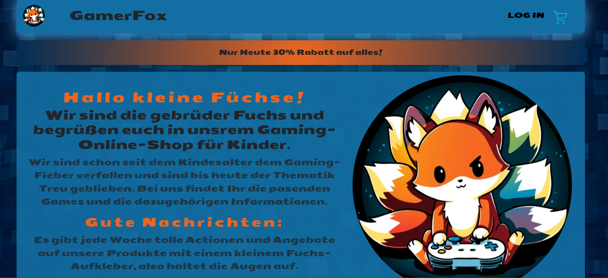

# 🦊 GamerFox – Online Shop

A React-based online shop for video games, designed as a kid-friendly gaming store run by the "Fox Brothers". Features user login, a shopping cart, and real Stripe payment integration.

## Live Demo

🔗 [View live](https://fox-online-shop.netlify.app/)



## Features

- 🎮 Product catalog with category filter (PlayStation, X-Box, Nintendo)
- 🔐 User login via Auth0 (email/password or Google)
- 🛒 Shopping cart with quantity adjustment
- 💰 Automatic 30% discount applied at checkout
- 💳 Real payment processing via Stripe (test mode)
- 🔒 Server-side price validation against tampering
- 📱 Responsive design for smartphones, tablets, and desktop

## Tech Stack

**Frontend:**
- React 18
- Redux Toolkit
- React Router
- React Bootstrap
- Auth0 (React SDK)
- Stripe (React SDK)

**Backend:**
- Node.js / Express
- Stripe API (server-side payment processing & price validation)

## Project Structure
```
├── public/                     # Static assets (images, icons)
├── src/
│   ├── assets/                 # Background video
│   ├── Components/
│   │   ├── Cart/               # Shopping cart components
│   │   ├── Filter/             # Category filter
│   │   └── GameComponents/     # Product cards
│   ├── data/                   # Product data
│   ├── pics/                   # UI icons
│   ├── redux/                  # State management (cart, filter)
│   ├── Stripe/                 # Checkout form
│   ├── App.js
│   ├── Shop.js
│   ├── Login.js
│   └── Logout.js
└── stripe-server/              # Node/Express server for payment processing
├── data/                       # Server-side product data (price validation)
└── index.js
```

## Note

This project runs in Stripe test mode. The backend (`stripe-server`) is deployed on Render; the frontend is deployed on Netlify. To test a payment on the live demo, use Stripe's test card `4242 4242 4242 4242` with any future expiry date and any 3-digit CVC.

All images / AI-generated images were sourced from open resources (pinterest.com, freepik.com) and are presented here for informational purposes only.

## Contact

Feel free to reach out via GitHub or Instagram:
- GitHub: [@VampireNoob](https://github.com/VampireNoob)
- Instagram: [@vampirenoob](https://www.instagram.com/vampirenoob/)